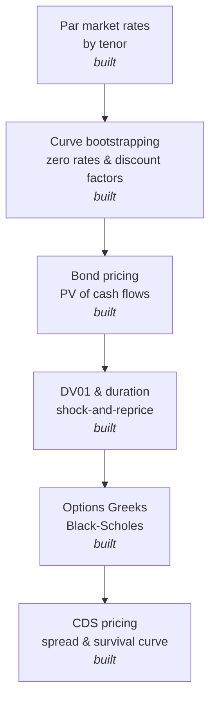

# Rates & Derivatives Engine

A from-scratch implementation of yield curve bootstrapping, bond pricing, and interest rate risk (DV01, modified duration), built to demonstrate the actual mechanics behind fixed income rate sensitivity rather than treating it as a black box.

## Why this exists

Rate mechanics and derivatives payoff logic are easy to wave hands at in an interview and much harder to actually reason through under pressure. This project exists to force that reasoning into working code: building a zero curve from market par rates, pricing a bond off it, and computing risk through the same shock-and-reprice approach production risk systems use.

## Architecture



## Design decisions

The curve is built by bootstrapping rather than by fitting a parametric model (Nelson-Siegel, splines, etc.), because bootstrapping is the part interviewers actually probe: given a par rate, why isn't the zero rate the same number? The answer is that a par bond's coupons get discounted at progressively higher rates as maturity increases, so the final discount factor has to absorb that effect, which is exactly what the bootstrap's `100 = pv_of_prior_coupons + (100 + coupon) * DF(n)` equation is doing at each step.

DV01 and modified duration are computed by shock-and-reprice rather than by closed-form duration formulas. Every par rate gets bumped up and down by 1 basis point, the curve gets rebuilt from each shocked set of rates, and the bond gets repriced off each one. The DV01 is the price difference between the down-shock and up-shock scenarios. This is deliberately the same parallel-shift methodology a real risk system uses, so the code stays honest about what duration actually measures: sensitivity to a shock, not an abstract formula.

The options Greeks are computed analytically from the closed-form Black-Scholes formulas, using only the standard normal CDF and PDF rather than a quant library. To prove the formulas are actually correct rather than just plausible-looking, `options_demo.py` includes a finite-difference check: it bumps the spot price up and down by a small amount, reprices the option both ways, and compares that numerical estimate of delta against the analytical one. The two match to five decimal places. The demo also handles a subtlety that's easy to get backwards under interview pressure: a call is in-the-money when the strike is below spot, but a put is in-the-money when the strike is above spot, the moneyness logic flips between the two, and the code makes that explicit rather than assuming it.

CDS pricing reuses the discount curve from the yield curve module rather than building a separate one, since both legs of a credit default swap need discounting. The survival curve is bootstrapped the same conceptual way as the yield curve: each tenor's market par spread implies one unknown survival probability, solved by setting the premium leg's present value equal to the protection leg's present value at that tenor. The genuinely easy mistake here is mixing up which sums can be reused across bootstrap steps: the protection leg's running total carries forward cleanly since it doesn't depend on spread, but the premium leg's annuity has to be reapplied with each tenor's *own* spread rather than reusing a blended historical sum, since each tenor represents a separate par contract rather than one contract's coupon schedule. `cds_demo.py` proves the bootstrap is correct by repricing every tenor's fair spread from the finished curve and confirming it reproduces the exact input spread used to build it. The mark-to-market example also makes the payoff direction explicit, the part most often gotten backwards under pressure: buying protection gains value when spreads widen, since the protection you locked in cheaply is now worth more than what you're paying for it.

## Getting started

Requires Python 3 only — no external dependencies.

```bash
git clone <your-repo-url>
cd rates-derivatives-engine
python3 demo.py
python3 options_demo.py
python3 cds_demo.py
```

Expected output from `demo.py`:

```
Bootstrapped zero curve:
  1Y   par=4.800%   zero=4.6884%   DF=0.954198
  2Y   par=4.700%   zero=4.5907%   DF=0.912276
  3Y   par=4.600%   zero=4.4914%   DF=0.873941
  4Y   par=4.520%   zero=4.4111%   DF=0.838245
  5Y   par=4.450%   zero=4.3400%   DF=0.804930

3Y bond, 5.00% coupon:
  Price: 101.0962
  DV01: 0.0276 per 1bp
  Modified duration: 2.7311 years

5Y bond, 4.50% coupon:
  Price: 100.2192
  DV01: 0.0439 per 1bp
  Modified duration: 4.3801 years
```

Expected output from `options_demo.py`:

```
--- CALL options, spot=100, vol=25%, 6-month expiry ---
  K= 85 (ITM): price=17.943  delta=+0.8688  gamma=0.01204  vega=0.1505  theta=-0.0179  rho=+0.3447
  K=100 (ATM): price= 8.008  delta=+0.5799  gamma=0.02211  vega=0.2764  theta=-0.0244  rho=+0.2499
  K=115 (OTM): price= 2.779  delta=+0.2779  gamma=0.01897  vega=0.2372  theta=-0.0190  rho=+0.1251

--- PUT options, spot=100, vol=25%, 6-month expiry ---
  K= 85 (OTM): price= 1.260  delta=-0.1312  gamma=0.01204  vega=0.1505  theta=-0.0087  rho=-0.0719
  K=100 (ATM): price= 6.028  delta=-0.4201  gamma=0.02211  vega=0.2764  theta=-0.0137  rho=-0.2402
  K=115 (ITM): price=15.502  delta=-0.7221  gamma=0.01897  vega=0.2372  theta=-0.0066  rho=-0.4386

Sanity check -- analytical delta vs. finite-difference delta:
  call: analytical=+0.57986   finite-difference=+0.57986
  put : analytical=-0.42014   finite-difference=-0.42014
```

Expected output from `cds_demo.py`:

```
Bootstrapped survival curve:
  1Y   survival=98.6842%   hazard=1.3245%
  2Y   survival=96.4008%   hazard=2.3411%
  3Y   survival=93.4304%   hazard=3.1298%
  4Y   survival=90.3841%   hazard=3.3148%
  5Y   survival=87.3517%   hazard=3.4126%

Sanity check -- repricing each tenor's fair spread against its own input spread:
  1Y: input=0.8000%   repriced=0.8000%
  2Y: input=1.1000%   repriced=1.1000%
  3Y: input=1.3500%   repriced=1.3500%
  4Y: input=1.5000%   repriced=1.5000%
  5Y: input=1.6000%   repriced=1.6000%

Mark-to-market example:
  Bought $10,000,000 of 5Y protection a year ago at a contractual spread of 1.30%.
  Today's 5Y fair spread on this curve: 1.60%
  Mark-to-market value of the position: $122,951.11
  (Positive because spreads widened since the trade was put on -- the protection
   you locked in cheaply is now worth more than what you're paying for it.)
```

## Project structure

```
yield_curve.py     # par curve bootstrapping, discount factors, zero rates
bond_pricer.py      # bond PV, DV01, and modified duration via shock-and-reprice
black_scholes.py     # European option pricing and Greeks (delta, gamma, vega, theta, rho)
cds_pricer.py          # survival curve bootstrapping, fair spread, mark-to-market valuation
demo.py                  # end-to-end yield curve and bond example
options_demo.py            # end-to-end options Greeks example with finite-difference validation
cds_demo.py                  # end-to-end CDS example with par-spread repricing validation
README.md
```

## Status

All planned pieces are built: curve bootstrapping, bond pricing and risk, options Greeks, and CDS pricing. Every module includes its own correctness check rather than just producing plausible-looking numbers: DV01 is internally consistent with duration, analytical option Greeks match finite-difference estimates, and the CDS bootstrap reprices every tenor back to its own input spread exactly.
