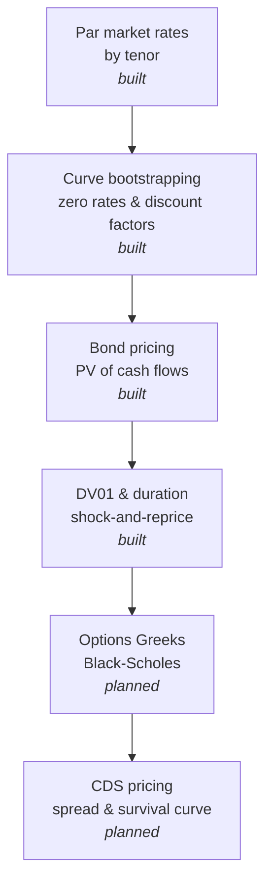

# Rates & Derivatives Engine

A from-scratch implementation of yield curve bootstrapping, bond pricing, and interest rate risk (DV01, modified duration), built to demonstrate the actual mechanics behind fixed income rate sensitivity rather than treating it as a black box.

## Why this exists

Rate mechanics and derivatives payoff logic are easy to wave hands at in an interview and much harder to actually reason through under pressure. This project exists to force that reasoning into working code: building a zero curve from market par rates, pricing a bond off it, and computing risk through the same shock-and-reprice approach production risk systems use.

## Architecture



## Design decisions

The curve is built by bootstrapping rather than by fitting a parametric model (Nelson-Siegel, splines, etc.), because bootstrapping is the part interviewers actually probe: given a par rate, why isn't the zero rate the same number? The answer is that a par bond's coupons get discounted at progressively higher rates as maturity increases, so the final discount factor has to absorb that effect, which is exactly what the bootstrap's `100 = pv_of_prior_coupons + (100 + coupon) * DF(n)` equation is doing at each step.

DV01 and modified duration are computed by shock-and-reprice rather than by closed-form duration formulas. Every par rate gets bumped up and down by 1 basis point, the curve gets rebuilt from each shocked set of rates, and the bond gets repriced off each one. The DV01 is the price difference between the down-shock and up-shock scenarios. This is deliberately the same parallel-shift methodology a real risk system uses, so the code stays honest about what duration actually measures: sensitivity to a shock, not an abstract formula.

## Getting started

Requires Python 3 only — no external dependencies.

```bash
git clone <your-repo-url>
cd rates-derivatives-engine
python3 demo.py
```

Expected output:

```
Bootstrapped zero curve:
  1Y   par=4.800%   zero=4.6884%   DF=0.954198
  2Y   par=4.700%   zero=4.5907%   DF=0.912276
  3Y   par=4.600%   zero=4.4914%   DF=0.873941
  4Y   par=4.520%   zero=4.4111%   DF=0.838245
  5Y   par=4.450%   zero=4.3400%   DF=0.804930

3Y bond, 5.00% coupon:
  Price: 101.0962
  DV01: 0.0276 per 1bp
  Modified duration: 2.7311 years

5Y bond, 4.50% coupon:
  Price: 100.2192
  DV01: 0.0439 per 1bp
  Modified duration: 4.3801 years
```

## Project structure

```
yield_curve.py    # par curve bootstrapping, discount factors, zero rates
bond_pricer.py     # bond PV, DV01, and modified duration via shock-and-reprice
demo.py             # end-to-end example
README.md
```

## Roadmap

- Options Greeks (delta, gamma, vega, theta, rho) via Black-Scholes, including ITM/OTM behavior across strikes
- Simplified CDS pricing: survival curve construction and spread valuation
